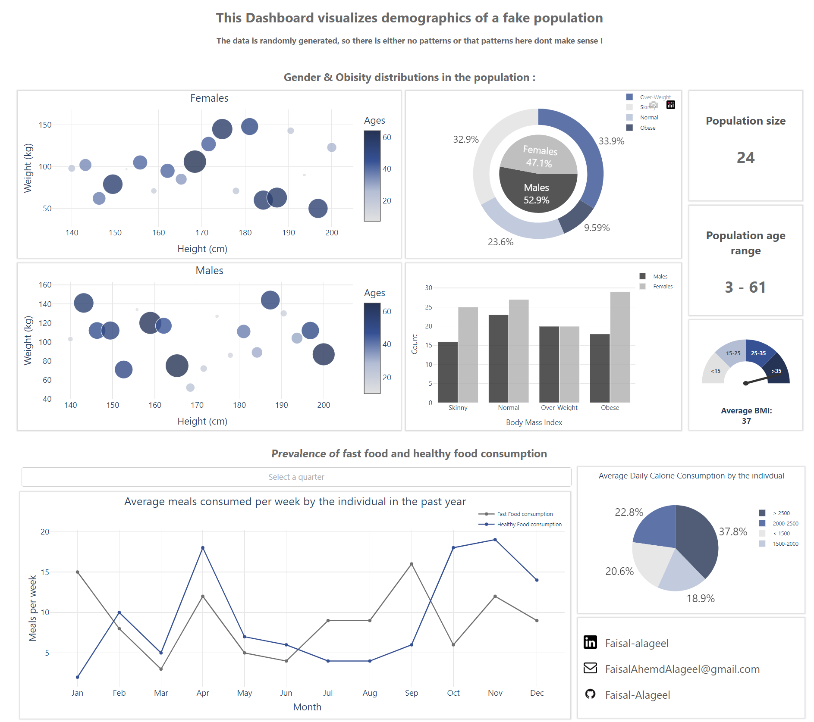

# Web Dashboard Using Dash Plotly 
An interactive web dashboard for data analysis and visualization.

# Link
You can access this dashboard and interact with it [Here](https://faisalalageel.pythonanywhere.com/).

This dashboard will be live and available on this link until Nov-2022.

## Description
I made this interactive web dashboard using python Dash framework.
This dashboard serves a general usage of visualization, therefore simple. 

## Instructions
-  To install the necessary dependencies, run the "requirements.txt" file on your virtual env
-  run the "app.py" file 
